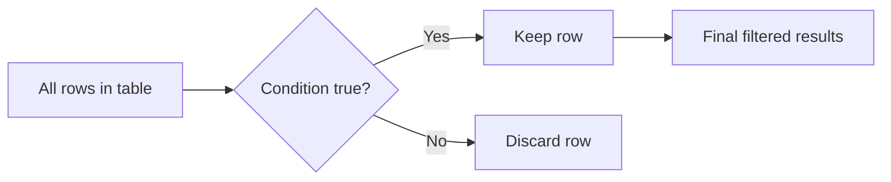

# Topic 03 — Filtering Data with WHERE
## Day 1 | Assmang Pty Ltd SQL100 Training

---

## 🎯 Learning Objectives

By the end of this topic, participants will be able to:
1. Use the WHERE clause to filter rows
2. Apply comparison operators (`=`, `<>`, `<`, `>`, `<=`, `>=`)
3. Combine conditions using `AND`, `OR`, `NOT`
4. Use `BETWEEN`, `IN`, `LIKE`, and NULL filters

---

## Beginner Visual Map (Layman Version)

`WHERE` is a sieve: you pour all rows in, and only matching rows come out.




## 1. The WHERE Clause

`WHERE` restricts which **rows** are returned — it filters by a condition.

```
SELECT  column1, column2
FROM    table_name
WHERE   condition;
```

**Execution Order (important!):**
```
1. FROM    — identify the table
2. WHERE   — filter rows
3. SELECT  — choose which columns to show
```

---

## 2. Comparison Operators

| Operator | Meaning | Example |
|----------|---------|---------|
| `=` | Equal to | `salary_zar = 75000` |
| `<>` or `!=` | Not equal to | `mine_type <> 'Chrome'` |
| `<` | Less than | `salary_zar < 50000` |
| `>` | Greater than | `salary_zar > 100000` |
| `<=` | Less than or equal | `salary_zar <= 50000` |
| `>=` | Greater than or equal | `salary_zar >= 80000` |

```sql
-- Employees earning exactly R75,000
SELECT first_name, last_name, salary_zar
FROM employees
WHERE salary_zar = 75000.00;

-- Employees NOT in department 2
SELECT first_name, last_name, department_id
FROM employees
WHERE department_id <> 2;

-- Employees earning more than R100,000
SELECT first_name, last_name, salary_zar
FROM employees
WHERE salary_zar > 100000;

-- Mines established before 1980
SELECT mine_name, established_year
FROM mines
WHERE established_year < 1980;

-- Departments with budget over R10 million
SELECT department_name, budget_zar
FROM departments
WHERE budget_zar >= 10000000;
```

### Filtering Text Columns
```sql
-- Exact text match (case-insensitive in MySQL by default)
SELECT * FROM mines WHERE mine_type = 'Iron Ore';
SELECT * FROM mines WHERE province = 'Northern Cape';
SELECT * FROM employees WHERE job_title = 'Driller';
```

### Filtering Dates
```sql
-- Employees hired on a specific date
SELECT first_name, last_name, hire_date
FROM employees
WHERE hire_date = '2015-03-01';

-- Employees hired after 2020
SELECT first_name, last_name, hire_date
FROM employees
WHERE hire_date > '2020-01-01';

-- Equipment purchased before 2018
SELECT equipment_code, equipment_type, purchase_date
FROM equipment
WHERE purchase_date < '2018-01-01';
```

---

## 3. AND, OR, NOT — Logical Operators

### AND — ALL conditions must be true
```sql
-- Engineering employees earning over R80,000
SELECT first_name, last_name, department_id, salary_zar
FROM employees
WHERE department_id = 3
  AND salary_zar > 80000;

-- Iron Ore mines in Northern Cape that are operational
SELECT mine_name, mine_type
FROM mines
WHERE mine_type = 'Iron Ore'
  AND province = 'Northern Cape'
  AND operational = 1;
```

### OR — AT LEAST ONE condition must be true
```sql
-- Finance OR IT department employees
SELECT first_name, last_name, department_id
FROM employees
WHERE department_id = 5
   OR department_id = 6;

-- Employees who are Drillers OR Blasters
SELECT first_name, last_name, job_title
FROM employees
WHERE job_title = 'Driller'
   OR job_title = 'Blaster';

-- Mines in Limpopo OR Mpumalanga
SELECT mine_name, province
FROM mines
WHERE province = 'Limpopo'
   OR province = 'Mpumalanga';
```

### NOT — Negate a condition
```sql
-- All employees who are NOT Mine Managers
SELECT first_name, last_name, job_title
FROM employees
WHERE NOT job_title = 'Mine Manager';

-- Mines that are NOT Iron Ore
SELECT mine_name, mine_type
FROM mines
WHERE NOT mine_type = 'Iron Ore';
```

### Operator Precedence
`NOT` > `AND` > `OR` — Use parentheses to be explicit!

```sql
-- WARNING: This returns different results depending on parentheses!

-- Without parentheses: AND is evaluated first
SELECT * FROM employees
WHERE department_id = 2 OR department_id = 3 AND salary_zar > 80000;
-- Means: dept=2 (any salary) OR (dept=3 AND salary>80000)

-- With parentheses: OR is evaluated first  
SELECT * FROM employees
WHERE (department_id = 2 OR department_id = 3) AND salary_zar > 80000;
-- Means: (dept=2 OR dept=3) AND salary>80000

-- ✅ BEST PRACTICE: Always use parentheses with mixed AND/OR
```

---

## 4. BETWEEN Operator

`BETWEEN` filters rows where a value is within a range (inclusive of both endpoints):

```sql
-- Employees with salary between R50,000 and R90,000 (inclusive)
SELECT first_name, last_name, salary_zar
FROM employees
WHERE salary_zar BETWEEN 50000 AND 90000;

-- Equivalent to:
WHERE salary_zar >= 50000 AND salary_zar <= 90000

-- Employees hired between 2015 and 2018
SELECT first_name, last_name, hire_date
FROM employees
WHERE hire_date BETWEEN '2015-01-01' AND '2018-12-31';

-- Departments with budget between R4M and R8M
SELECT department_name, budget_zar
FROM departments
WHERE budget_zar BETWEEN 4000000 AND 8000000;

-- NOT BETWEEN — outside the range
SELECT mine_name, established_year
FROM mines
WHERE established_year NOT BETWEEN 1960 AND 1990;
```

---

## 5. IN Operator

`IN` matches against a **list** of values — cleaner than multiple OR conditions:

```sql
-- Employees in departments 1, 4, or 6
SELECT first_name, last_name, department_id
FROM employees
WHERE department_id IN (1, 4, 6);

-- Equivalent to:
WHERE department_id = 1 OR department_id = 4 OR department_id = 6

-- Employees who are Drillers, Blasters, or Truck Operators
SELECT first_name, last_name, job_title
FROM employees
WHERE job_title IN ('Driller', 'Blaster', 'Truck Operator');

-- Mines in two provinces
SELECT mine_name, province
FROM mines
WHERE province IN ('Limpopo', 'Mpumalanga');

-- NOT IN — exclude list
SELECT first_name, last_name, job_title
FROM employees
WHERE job_title NOT IN ('Mine Manager', 'HR Manager', 'Finance Director');
```

> ⚠️ **Warning:** `NOT IN` with NULL values can produce unexpected results — use carefully!

---

## 6. LIKE and Wildcards

`LIKE` performs **pattern matching** on text:

| Wildcard | Meaning | Example |
|----------|---------|---------|
| `%` | Matches zero or more characters | `'B%'` → Beeshoek, Black Rock |
| `_` | Matches exactly one character | `'_han'` → Johan |

```sql
-- Names starting with 'B'
SELECT mine_name FROM mines WHERE mine_name LIKE 'B%';
-- Returns: Beeshoek Mine, Black Rock Mine

-- Names ending with 'Mine'
SELECT mine_name FROM mines WHERE mine_name LIKE '%Mine';
-- Returns: Beeshoek Mine, Khumani Mine, Black Rock Mine, Gloria Mine

-- Names containing 'Rock'
SELECT mine_name FROM mines WHERE mine_name LIKE '%Rock%';
-- Returns: Black Rock Mine

-- Email addresses at assmang
SELECT email FROM employees WHERE email LIKE '%@assmang.co.za';

-- Employees with exactly 5-character first names
SELECT first_name FROM employees WHERE first_name LIKE '_____';
-- (5 underscores = 5 characters)

-- Job titles containing "Manager"
SELECT DISTINCT job_title FROM employees WHERE job_title LIKE '%Manager%';

-- NOT LIKE
SELECT mine_name FROM mines WHERE mine_name NOT LIKE 'B%';
-- Returns mines NOT starting with B

-- LIKE with LOWER for case-insensitive safety
SELECT first_name FROM employees WHERE LOWER(first_name) LIKE 'no%';
-- Returns: Nomsa, Nosipho, Nolwazi
```

---

## 7. IS NULL / IS NOT NULL

```sql
-- Employees with no mine assignment (Head Office)
SELECT first_name, last_name, job_title, mine_id
FROM employees
WHERE mine_id IS NULL;

-- Employees assigned to a mine
SELECT first_name, last_name, mine_id
FROM employees
WHERE mine_id IS NOT NULL;

-- Employees with no manager (top-level)
SELECT first_name, last_name, job_title, manager_id
FROM employees
WHERE manager_id IS NULL;

-- ❌ WRONG — these will NOT work for NULL comparison:
WHERE mine_id = NULL        -- Always false!
WHERE mine_id != NULL       -- Always false!
```

---

## 8. Combining Everything — Realistic Scenarios

### Scenario 1: Safety Report — Active mining employees at Beeshoek
```sql
SELECT
    first_name,
    last_name,
    job_title,
    hire_date
FROM employees
WHERE mine_id = 1
  AND is_active = 1
  AND department_id = 2;
```

### Scenario 2: Payroll — Mid-range employees
```sql
SELECT
    CONCAT(first_name, ' ', last_name)  AS employee,
    department_id,
    salary_zar
FROM employees
WHERE salary_zar BETWEEN 40000 AND 70000
ORDER BY salary_zar DESC;
```

### Scenario 3: Asset register — Active non-Komatsu trucks
```sql
SELECT equipment_code, equipment_type, manufacturer, mine_id
FROM equipment
WHERE equipment_type = 'Haul Truck'
  AND manufacturer <> 'Komatsu'
  AND status = 'Active';
```

### Scenario 4: HR audit — Recently hired or senior staff
```sql
SELECT
    first_name,
    last_name,
    hire_date,
    salary_zar
FROM employees
WHERE hire_date >= '2021-01-01'
   OR salary_zar >= 100000;
```

---

## ⚠️ Common Mistakes

| Mistake | Wrong | Right |
|---------|-------|-------|
| NULL comparison | `WHERE mine_id = NULL` | `WHERE mine_id IS NULL` |
| String without quotes | `WHERE province = Northern Cape` | `WHERE province = 'Northern Cape'` |
| Wrong precedence | `WHERE a=1 OR b=2 AND c=3` | `WHERE a=1 OR (b=2 AND c=3)` |
| BETWEEN endpoint order | `WHERE salary BETWEEN 90000 AND 50000` | `WHERE salary BETWEEN 50000 AND 90000` |
| NOT IN with NULL | `WHERE id NOT IN (1, 2, NULL)` — returns no rows! | Remove NULLs from IN list |

---

## 📌 WHERE Clause Quick Reference

```sql
SELECT columns
FROM table
WHERE
    column = value                      -- exact match
    column <> value                     -- not equal
    column > value                      -- greater than
    column BETWEEN low AND high         -- inclusive range
    column IN (v1, v2, v3)             -- match any in list
    column LIKE 'pattern%'             -- text pattern
    column IS NULL                      -- no value
    condition1 AND condition2           -- both must be true
    condition1 OR condition2            -- either must be true
    NOT condition                       -- negate
;
```

