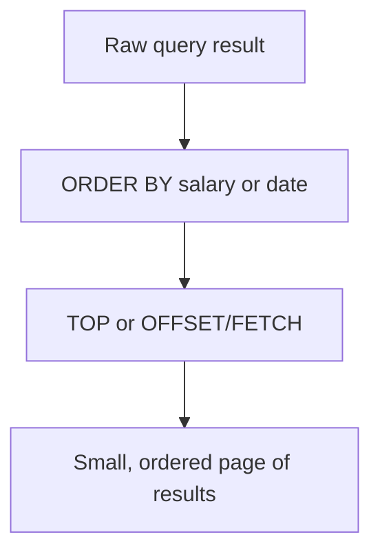

# Topic 04 — Sorting, Limiting & Ordering Results
## Day 1 | Assmang Pty Ltd SQL100 Training

---

## 🎯 Learning Objectives

By the end of this topic, participants will be able to:
1. Sort query results using ORDER BY (ASC and DESC)
2. Sort by multiple columns
3. Limit results using TOP and OFFSET/FETCH
4. Understand how NULLs behave in sorted results
5. Use the full SELECT query structure correctly

---

## Beginner Visual Map (Layman Version)

Sorting is like arranging books on a shelf; limiting is like saying "show me only the first few books."




## 1. ORDER BY Clause

`ORDER BY` sorts the result set by one or more columns.

```
SELECT  columns
FROM    table
WHERE   condition
ORDER BY column [ASC | DESC];
```

### Default: Ascending (ASC)
```sql
-- Sort employees by salary, lowest first (default = ASC)
SELECT first_name, last_name, salary_zar
FROM employees
ORDER BY salary_zar;

-- Explicit ASC (same result)
SELECT first_name, last_name, salary_zar
FROM employees
ORDER BY salary_zar ASC;
```

### Descending (DESC)
```sql
-- Highest salary first
SELECT first_name, last_name, salary_zar
FROM employees
ORDER BY salary_zar DESC;

-- Most recently hired first
SELECT first_name, last_name, hire_date
FROM employees
ORDER BY hire_date DESC;

-- Alphabetical by last name
SELECT first_name, last_name
FROM employees
ORDER BY last_name ASC;
```

---

## 2. Sorting by Multiple Columns

When the first sort column has ties, the second column breaks the tie:

```sql
-- Sort by department first, then by salary (highest to lowest) within each department
SELECT first_name, last_name, department_id, salary_zar
FROM employees
ORDER BY department_id ASC,
         salary_zar DESC;

-- Sort mines by type, then by year established
SELECT mine_name, mine_type, established_year
FROM mines
ORDER BY mine_type ASC,
         established_year ASC;

-- Sort by province, then mine type, then mine name
SELECT mine_name, mine_type, province, established_year
FROM mines
ORDER BY province ASC,
         mine_type ASC,
         mine_name ASC;
```

---

## 3. Sorting by Column Position

You can reference columns by their position in the SELECT list:

```sql
-- Column 3 = salary_zar, column 2 = last_name
SELECT first_name, last_name, salary_zar
FROM employees
ORDER BY 3 DESC, 2 ASC;
-- Sorts by salary_zar DESC, then last_name ASC

-- ⚠️ Avoid position-based ORDER BY in production:
-- Hard to read; breaks if column order changes
```

---

## 4. Sorting with Expressions and Aliases

```sql
-- Sort by calculated annual salary
SELECT
    first_name,
    last_name,
    salary_zar * 12 AS annual_salary
FROM employees
ORDER BY annual_salary DESC;      -- Use alias in ORDER BY

-- Sort by string function result
SELECT first_name, last_name
FROM employees
ORDER BY LENGTH(last_name) DESC;  -- Longest surname first

-- Sort by CASE WHEN result
SELECT
    mine_name,
    mine_type,
    CASE mine_type
        WHEN 'Iron Ore'  THEN 1
        WHEN 'Manganese' THEN 2
        WHEN 'Chrome'    THEN 3
    END AS sort_order
FROM mines
ORDER BY sort_order;
```

---

## 5. NULLs in Sorted Results

By default in SQL Server:
- `ORDER BY ASC` → NULLs appear **first**
- `ORDER BY DESC` → NULLs appear **last**

```sql
-- Employees sorted by mine_id ASC — NULL mine_ids appear first
SELECT first_name, last_name, mine_id
FROM employees
ORDER BY mine_id ASC;

-- NULLs last (workaround)
SELECT first_name, last_name, mine_id
FROM employees
ORDER BY mine_id IS NULL ASC, mine_id ASC;
-- mine_id IS NULL = 0 (not null) or 1 (null); sorting 0 first puts NULLs last

-- NULLs first (workaround)
SELECT first_name, last_name, mine_id
FROM employees
ORDER BY mine_id IS NULL DESC, mine_id ASC;
```

---

## 6. TOP — Restrict Returned Rows

`TOP` restricts how many rows are returned. Always use with `ORDER BY` for predictable results.

```sql
-- Return only the first 5 rows
SELECT TOP (5) first_name, last_name, salary_zar
FROM employees
ORDER BY salary_zar DESC;

-- Return only 1 row (the single highest-paid employee)
SELECT TOP (1) first_name, last_name, salary_zar
FROM employees
ORDER BY salary_zar DESC;

-- Return exactly 3 most recently hired
SELECT TOP (3) first_name, last_name, hire_date
FROM employees
ORDER BY hire_date DESC;
```

---

## 7. OFFSET/FETCH — Skip Rows (Pagination)

`OFFSET` skips a number of rows before starting to return results. Combined with `FETCH NEXT` for pagination:

```
OFFSET  rows_to_skip  ROWS FETCH NEXT  rows_to_return  ROWS ONLY
```

```sql
-- Page 1: first 5 employees (rows 1–5)
SELECT first_name, last_name, salary_zar
FROM employees
ORDER BY employee_id
OFFSET 0 ROWS FETCH NEXT 5 ROWS ONLY;

-- Page 2: next 5 employees (rows 6–10)
SELECT first_name, last_name, salary_zar
FROM employees
ORDER BY employee_id
OFFSET 5 ROWS FETCH NEXT 5 ROWS ONLY;

-- Page 3: rows 11–15
SELECT first_name, last_name, salary_zar
FROM employees
ORDER BY employee_id
OFFSET 10 ROWS FETCH NEXT 5 ROWS ONLY;

-- SQL Server uses OFFSET/FETCH rather than LIMIT shorthand
SELECT * FROM employees
ORDER BY employee_id
OFFSET 10 ROWS FETCH NEXT 5 ROWS ONLY;
```

### Pagination Formula
```
OFFSET = (page_number - 1) × rows_per_page
Page 1: OFFSET = (1-1) × 5 = 0
Page 2: OFFSET = (2-1) × 5 = 5
Page 3: OFFSET = (3-1) × 5 = 10
```

---

## 8. Complete Query Structure — All Clauses

```sql
SELECT   [DISTINCT] column1, column2, expression AS alias
FROM     table_name
WHERE    condition
ORDER BY column [ASC|DESC], column2 [ASC|DESC]
OFFSET   m ROWS
FETCH NEXT n ROWS ONLY;
```

### SQL Execution Order (different from writing order!)
```
1. FROM      ← Which table?
2. WHERE     ← Which rows?
3. SELECT    ← Which columns and expressions?
4. DISTINCT  ← Remove duplicates?
5. ORDER BY  ← How to sort?
6. OFFSET/FETCH ← How many rows and from where?
```

> **Key Insight:** `WHERE` runs BEFORE `SELECT` — that's why you can't use a column alias in a WHERE clause (the alias doesn't exist yet when WHERE evaluates).

```sql
-- ❌ WRONG — alias used in WHERE (alias not yet defined)
SELECT salary_zar * 12 AS annual_salary
FROM employees
WHERE annual_salary > 1000000;   -- ERROR!

-- ✅ CORRECT — repeat the expression, or use a subquery
SELECT salary_zar * 12 AS annual_salary
FROM employees
WHERE salary_zar * 12 > 1000000;  -- Works!
```

---

## 9. Realistic Sorting Scenarios

### Scenario 1: Management Report — Top 5 Earners
```sql
SELECT
    CONCAT(first_name, ' ', last_name)  AS employee,
    job_title,
    salary_zar,
    ROUND(salary_zar * 12, 2)           AS annual_salary
FROM employees
ORDER BY salary_zar DESC;
SELECT TOP (5) first_name, last_name, salary_zar
FROM employees
ORDER BY salary_zar DESC;
```

### Scenario 2: Safety Report — Longest-Serving Field Staff
```sql
SELECT
    CONCAT(first_name, ' ', last_name)              AS employee,
    job_title,
    hire_date,
    DATEDIFF(YEAR, hire_date, GETDATE())            AS years_service
FROM employees
WHERE mine_id IS NOT NULL
ORDER BY hire_date ASC
OFFSET 0 ROWS FETCH NEXT 10 ROWS ONLY;
```

### Scenario 3: Finance — Department Budget Ranking
```sql
SELECT
    department_name                             AS department,
    location,
    budget_zar,
    ROUND(budget_zar / 1000000, 1)              AS budget_millions
FROM departments
ORDER BY budget_zar DESC;
```

### Scenario 4: Mines Ordered by Age (Oldest First)
```sql
SELECT
    mine_name,
    mine_type,
    province,
    established_year,
    YEAR(GETDATE()) - established_year          AS years_operating
FROM mines
ORDER BY established_year ASC;
```

---

## ⚠️ Common Mistakes

| Mistake | Wrong | Right |
|---------|-------|-------|
| Alias in WHERE | `WHERE annual_salary > 1M` | `WHERE salary_zar * 12 > 1000000` |
| OFFSET/FETCH without ORDER BY | `OFFSET/FETCH` without ordering is unpredictable | Add `ORDER BY` first |
| Wrong OFFSET calculation | `OFFSET 1 ROWS FETCH NEXT 5 ROWS ONLY` for page 2 | `OFFSET 5 ROWS FETCH NEXT 5 ROWS ONLY` |
| Mixing ASC/DESC on one column | `ORDER BY salary ASC DESC` | Choose one direction |

---

## 📌 Quick Reference

```sql
ORDER BY col1 ASC            -- ascending (default)
ORDER BY col1 DESC           -- descending
ORDER BY col1 ASC, col2 DESC -- multi-column sort
ORDER BY 3 DESC              -- by SELECT list position (avoid)
OFFSET 0 ROWS FETCH NEXT 10 ROWS ONLY      -- first 10 rows
OFFSET 20 ROWS FETCH NEXT 10 ROWS ONLY     -- rows 21–30
```

