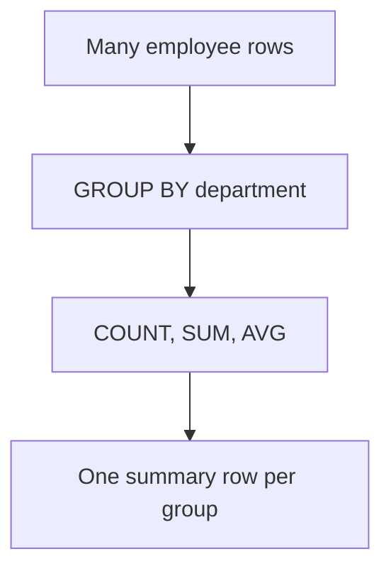

# Topic 01 — Aggregate Functions & GROUP BY / HAVING
## Day 2 | Assmang Pty Ltd SQL100 Training

---

## 🎯 Learning Objectives

By the end of this topic, participants will be able to:
1. Use aggregate functions: COUNT, SUM, AVG, MIN, MAX
2. Group rows using GROUP BY
3. Filter grouped results with HAVING
4. Distinguish between WHERE and HAVING
5. Understand the complete SQL query execution order

---

## Beginner Visual Map (Layman Version)

Aggregates are like getting a summary from a long list: total, average, highest, lowest.




## 1. What Are Aggregate Functions?

### Concept Diagram


Aggregate functions perform a calculation on **multiple rows** and return a **single value**.

| Function | Returns | NULL handling |
|----------|---------|---------------|
| `COUNT(*)` | Total row count | Includes NULLs |
| `COUNT(col)` | Count of non-NULL values | Excludes NULLs |
| `SUM(col)` | Total of all values | Ignores NULLs |
| `AVG(col)` | Average (mean) | Ignores NULLs |
| `MIN(col)` | Smallest value | Ignores NULLs |
| `MAX(col)` | Largest value | Ignores NULLs |

---

## 2. COUNT()

### Concept Diagram

```mermaid
flowchart LR
    A[Goal: COUNT()] --> B[Example SQL]
    B --> C[SELECT COUNT(*) AS total_employees FROM employees;]
    C --> D[Understand result in plain language]
```

```sql
-- Count all employees (rows)
SELECT COUNT(*) AS total_employees FROM employees;
-- Returns: 31

-- Count only non-NULL mine_id values
SELECT COUNT(mine_id) AS assigned_to_mine FROM employees;
-- Returns: 18 (excludes 13 NULLs)

-- Count distinct departments
SELECT COUNT(DISTINCT department_id) AS num_departments FROM employees;
-- Returns: 8

-- Count by condition
SELECT COUNT(*) AS mining_ops_count
FROM employees
WHERE department_id = 2;
-- Returns: 9
```

---

## 3. SUM()

### Concept Diagram

```mermaid
flowchart LR
    A[Goal: SUM()] --> B[Example SQL]
    B --> C[SELECT SUM(salary_zar) AS total_monthly_payroll FROM employees;]
    C --> D[Understand result in plain language]
```

```sql
-- Total salary bill for all employees
SELECT SUM(salary_zar) AS total_monthly_payroll FROM employees;

-- Total annual payroll
SELECT SUM(salary_zar * 12) AS total_annual_payroll FROM employees;

-- Total budget across all departments
SELECT SUM(budget_zar) AS total_company_budget FROM departments;

-- Total purchase cost of all equipment
SELECT SUM(purchase_price) AS total_asset_value FROM equipment;

-- Total production for Beeshoek Mine
SELECT SUM(tonnes_mined) AS total_tonnes_mined_2023
FROM production_monthly
WHERE mine_id = 1;
```

---

## 4. AVG()

### Concept Diagram

```mermaid
flowchart LR
    A[Goal: AVG()] --> B[Example SQL]
    B --> C[SELECT ROUND(AVG(salary_zar), 2) AS avg_monthly_salary FROM employees;]
    C --> D[Understand result in plain language]
```

```sql
-- Average salary
SELECT ROUND(AVG(salary_zar), 2) AS avg_monthly_salary FROM employees;

-- Average annual production per month (Khumani Mine)
SELECT ROUND(AVG(tonnes_mined), 0) AS avg_monthly_tonnes
FROM production_monthly
WHERE mine_id = 2;

-- Average equipment purchase price
SELECT ROUND(AVG(purchase_price), 2) AS avg_equipment_cost FROM equipment;
```

---

## 5. MIN() and MAX()

### Concept Diagram

```mermaid
flowchart LR
    A[Goal: MIN() and MAX()] --> B[Example SQL]
    B --> C[SELECT]
    C --> D[Understand result in plain language]
```

```sql
-- Salary range
SELECT
    MIN(salary_zar) AS lowest_salary,
    MAX(salary_zar) AS highest_salary,
    MAX(salary_zar) - MIN(salary_zar) AS salary_range
FROM employees;

-- Earliest and latest hire dates
SELECT
    MIN(hire_date) AS first_hire,
    MAX(hire_date) AS most_recent_hire
FROM employees;

-- Production range for Beeshoek Mine 2023
SELECT
    MIN(tonnes_mined) AS min_monthly_production,
    MAX(tonnes_mined) AS max_monthly_production
FROM production_monthly
WHERE mine_id = 1;
```

---

## 6. GROUP BY — Grouping Rows

### Concept Diagram

```mermaid
flowchart LR
    A[Goal: GROUP BY — Grouping Rows] --> B[Example SQL]
    B --> C[SELECT department_id, COUNT(*) AS employee_count]
    C --> D[Understand result in plain language]
```

Without GROUP BY, aggregates return a single row for the entire table.  
With GROUP BY, aggregates return one row **per group**.

```sql
-- Count employees per department
SELECT department_id, COUNT(*) AS employee_count
FROM employees
GROUP BY department_id;

-- Average salary per department
SELECT
    department_id,
    COUNT(*)                        AS headcount,
    ROUND(AVG(salary_zar), 2)       AS avg_salary,
    MIN(salary_zar)                 AS min_salary,
    MAX(salary_zar)                 AS max_salary,
    SUM(salary_zar)                 AS total_salary_bill
FROM employees
GROUP BY department_id
ORDER BY total_salary_bill DESC;
```

> **Rule:** Every column in SELECT must either be:
> 1. An aggregate function, OR
> 2. In the GROUP BY clause

```sql
-- ❌ WRONG — first_name not in GROUP BY and not aggregated
SELECT first_name, department_id, COUNT(*)
FROM employees
GROUP BY department_id;

-- ✅ CORRECT
SELECT department_id, COUNT(*) AS headcount
FROM employees
GROUP BY department_id;
```

### Grouping by Multiple Columns
```sql
-- Count employees per department per mine
SELECT department_id, mine_id, COUNT(*) AS count
FROM employees
WHERE mine_id IS NOT NULL
GROUP BY department_id, mine_id
ORDER BY department_id, mine_id;

-- Total production by mine and year
SELECT mine_id, production_year,
       SUM(tonnes_mined) AS annual_tonnes
FROM production_monthly
GROUP BY mine_id, production_year
ORDER BY mine_id, production_year;
```

### GROUP BY with WHERE
```sql
-- Average salary per department (active employees only)
SELECT
    department_id,
    ROUND(AVG(salary_zar), 2) AS avg_salary
FROM employees
WHERE is_active = 1           -- filter rows BEFORE grouping
GROUP BY department_id
ORDER BY avg_salary DESC;

-- Production per mine (only months with > 100,000 tonnes mined — filter BEFORE grouping)
SELECT mine_id, COUNT(*) AS months_above_100k
FROM production_monthly
WHERE tonnes_mined > 100000
GROUP BY mine_id;
```

---

## 7. HAVING — Filtering Groups

### Concept Diagram

```mermaid
flowchart LR
    A[Goal: HAVING — Filtering Groups] --> B[Example SQL]
    B --> C[SELECT department_id, COUNT(*) AS headcount]
    C --> D[Understand result in plain language]
```

`HAVING` filters the **result of a GROUP BY** — like WHERE but for groups.

```sql
-- Departments with more than 3 employees
SELECT department_id, COUNT(*) AS headcount
FROM employees
GROUP BY department_id
HAVING COUNT(*) > 3;

-- Departments with average salary above R60,000
SELECT department_id,
       ROUND(AVG(salary_zar), 2) AS avg_salary
FROM employees
GROUP BY department_id
HAVING AVG(salary_zar) > 60000
ORDER BY avg_salary DESC;

-- Mines that produced more than 2,000,000 total tonnes in 2023
SELECT mine_id,
       SUM(tonnes_mined) AS total_annual_tonnes
FROM production_monthly
WHERE production_year = 2023
GROUP BY mine_id
HAVING SUM(tonnes_mined) > 2000000
ORDER BY total_annual_tonnes DESC;

-- Equipment types with more than 3 pieces of equipment
SELECT equipment_type, COUNT(*) AS count
FROM equipment
GROUP BY equipment_type
HAVING COUNT(*) > 3;
```

---

## 8. WHERE vs HAVING — Key Distinction

### Concept Diagram

```mermaid
flowchart LR
    A[Goal: WHERE vs HAVING — Key Distinction] --> B[Example SQL]
    B --> C[SELECT department_id, COUNT(*)]
    C --> D[Understand result in plain language]
```

```
┌────────────────────────────────────────────────────────────────┐
│                WHERE vs HAVING                                  │
├────────────────────┬───────────────────────────────────────────┤
│ WHERE              │ Filters individual ROWS before grouping   │
│                    │ Cannot use aggregate functions             │
│                    │ Runs BEFORE GROUP BY                       │
├────────────────────┼───────────────────────────────────────────┤
│ HAVING             │ Filters GROUPS after aggregation           │
│                    │ CAN use aggregate functions                │
│                    │ Runs AFTER GROUP BY                        │
└────────────────────┴───────────────────────────────────────────┘
```

```sql
-- ❌ WRONG — cannot use aggregate in WHERE
SELECT department_id, COUNT(*)
FROM employees
WHERE COUNT(*) > 3        -- ERROR!
GROUP BY department_id;

-- ✅ CORRECT — use HAVING for aggregate conditions
SELECT department_id, COUNT(*) AS headcount
FROM employees
GROUP BY department_id
HAVING COUNT(*) > 3;

-- Using BOTH WHERE and HAVING
SELECT department_id,
       ROUND(AVG(salary_zar), 2) AS avg_salary
FROM employees
WHERE is_active = 1              -- Step 1: Filter active employees (row-level)
GROUP BY department_id           -- Step 2: Group them
HAVING AVG(salary_zar) > 55000  -- Step 3: Keep groups where avg > 55k
ORDER BY avg_salary DESC;        -- Step 4: Sort
```

---

## 9. Full Query Execution Order

### Concept Diagram

```mermaid
flowchart LR
    A[Goal: Full Query Execution Order] --> B[Example SQL]
    B --> C[FROM | 1 | Load the table(s)]
    C --> D[Understand result in plain language]
```

```
Clause      | Execution Order | What It Does
────────────────────────────────────────────────────────────────
FROM        | 1               | Load the table(s)
WHERE       | 2               | Filter individual rows
GROUP BY    | 3               | Group filtered rows
HAVING      | 4               | Filter the groups
SELECT      | 5               | Compute columns/expressions
DISTINCT    | 6               | Remove duplicates
ORDER BY    | 7               | Sort the final result
OFFSET/FETCH| 8               | Limit rows returned
```

### Putting It All Together
```sql
-- Full query using all clauses
SELECT
    department_id                       AS dept,
    COUNT(*)                            AS headcount,
    ROUND(AVG(salary_zar), 2)           AS avg_salary,
    SUM(salary_zar)                     AS monthly_bill
FROM employees                          -- 1. From employees table
WHERE is_active = 1                     -- 2. Active only
GROUP BY department_id                  -- 3. Group by dept
HAVING COUNT(*) >= 3                    -- 4. Dept must have 3+ employees
ORDER BY monthly_bill DESC              -- 5. Sort by highest bill
OFFSET 0 ROWS FETCH NEXT 5 ROWS ONLY;    -- 6. Top 5 only
```

---

## 10. Realistic Assmang Scenarios

### Concept Diagram


### Scenario 1: Monthly Payroll Summary by Department
```sql
SELECT
    department_id,
    COUNT(*)                        AS headcount,
    ROUND(AVG(salary_zar), 2)       AS avg_monthly_salary,
    SUM(salary_zar)                 AS total_monthly_payroll
FROM employees
WHERE is_active = 1
GROUP BY department_id
ORDER BY total_monthly_payroll DESC;
```

### Scenario 2: Production Performance by Mine (2023)
```sql
SELECT
    mine_id,
    SUM(tonnes_mined)               AS total_mined,
    SUM(tonnes_processed)           AS total_processed,
    ROUND(AVG(ore_grade_pct), 2)    AS avg_grade,
    SUM(revenue_zar)                AS total_revenue,
    COUNT(*)                        AS months_reported
FROM production_monthly
WHERE production_year = 2023
GROUP BY mine_id
ORDER BY total_revenue DESC;
```

### Scenario 3: Equipment Count and Value by Mine
```sql
SELECT
    mine_id,
    COUNT(*)                        AS equipment_count,
    SUM(purchase_price)             AS total_asset_value,
    ROUND(AVG(purchase_price), 2)   AS avg_equipment_cost,
    MIN(purchase_date)              AS oldest_purchase,
    MAX(purchase_date)              AS newest_purchase,
    SUM(CASE WHEN status = 'Active' THEN 1 ELSE 0 END) AS active_count,
    SUM(CASE WHEN status = 'Maintenance' THEN 1 ELSE 0 END) AS in_maintenance
FROM equipment
GROUP BY mine_id
ORDER BY total_asset_value DESC;
```

---

## ⚠️ Common Mistakes

| Mistake | Wrong | Right |
|---------|-------|-------|
| Non-aggregated col in SELECT | `SELECT dept, first_name, COUNT(*)` with GROUP BY dept | Include first_name in GROUP BY or remove it |
| Aggregate in WHERE | `WHERE COUNT(*) > 3` | `HAVING COUNT(*) > 3` |
| Forgetting GROUP BY | `SELECT dept, COUNT(*)` without GROUP BY | Add `GROUP BY dept` |
| COUNT(*) vs COUNT(col) confusion | `COUNT(mine_id)` counts 18 (ignores NULLs) | Use `COUNT(*)` to count all rows |

---

## 📌 Quick Reference

```sql
-- Basic aggregates
COUNT(*) | COUNT(col) | SUM(col) | AVG(col) | MIN(col) | MAX(col)

-- Group by one column
SELECT col, AGG_FUNC() FROM table GROUP BY col;

-- Group + filter rows before grouping (WHERE)
SELECT col, COUNT(*) FROM table WHERE condition GROUP BY col;

-- Filter groups after grouping (HAVING)
SELECT col, COUNT(*) FROM table GROUP BY col HAVING COUNT(*) > n;

-- Full structure
SELECT col, AGG() FROM t WHERE row_filter GROUP BY col HAVING group_filter ORDER BY col;
```

