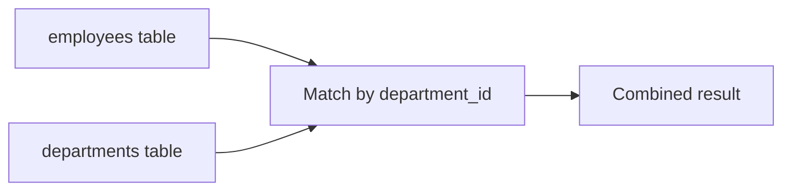
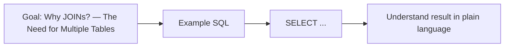
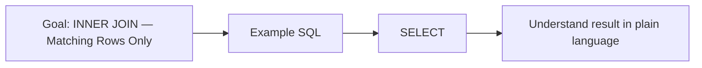
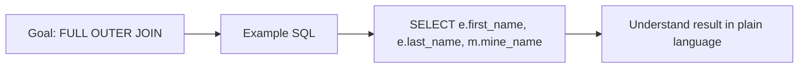
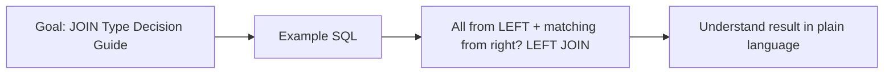
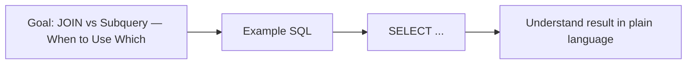

# Topic 02 — Joining Tables & Subqueries
## Day 2 | Assmang Pty Ltd SQL100 Training

---

## 🎯 Learning Objectives

1. Explain why JOINs are needed (normalisation)
2. Write INNER, LEFT, RIGHT, and FULL OUTER JOINs
3. Join more than two tables
4. Use table aliases in joins
5. Write subqueries in WHERE, FROM, and SELECT clauses
6. Decide when to use a JOIN vs a subquery

---

## Beginner Visual Map (Layman Version)

A JOIN is like matching two lists using a shared code (for example, `department_id`).




## 1. Why JOINs? — The Need for Multiple Tables

### Concept Diagram



Relational databases store data across multiple tables to avoid duplication (normalisation).

**Without JOINs — data duplication problem:**
```
employees table (bad design — department name repeated):
employee_id | name      | department_name              | dept_location
1           | Nomsa D.  | Human Resources              | Kathu, NC
2           | Thabo M.  | Human Resources              | Kathu, NC  ← duplicate!
3           | Sibongile | Human Resources              | Kathu, NC  ← duplicate!
```

**With normalisation — clean design:**
```
departments:               employees:
dept_id | dept_name        emp_id | name      | dept_id (FK)
1       | Human Resources  1      | Nomsa D.  | 1
                           2      | Thabo M.  | 1
```

JOINs re-combine this data at query time — without duplicating storage.

---

## 2. JOIN Syntax

### Concept Diagram


```sql
SELECT  t1.col1, t2.col2
FROM    table1  t1
JOIN    table2  t2  ON t1.shared_key = t2.shared_key;
```

---

## 3. INNER JOIN — Matching Rows Only

### Concept Diagram



Returns rows where the join condition is satisfied in **BOTH** tables.

```
Table A:           Table B:           INNER JOIN result:
dept_id  name      dept_id  budget    dept_id  name    budget
1        HR        1        5200000   1        HR      5200000
2        Mining    2        45000000  2        Mining  45000000
3        Eng       3        18500000  3        Eng     18500000
9        Ghost     -----              (no match — excluded)
```

```sql
-- Employee names with their department names
SELECT
    e.first_name,
    e.last_name,
    e.job_title,
    d.department_name,
    d.location
FROM employees e
INNER JOIN departments d ON e.department_id = d.department_id;

-- Employee names with their mine information
SELECT
    e.first_name,
    e.last_name,
    e.job_title,
    m.mine_name,
    m.mine_type
FROM employees e
INNER JOIN mines m ON e.mine_id = m.mine_id;
-- Note: 13 head-office employees are excluded (mine_id IS NULL)

-- Equipment with mine names
SELECT
    eq.equipment_code,
    eq.equipment_type,
    eq.manufacturer,
    eq.status,
    m.mine_name
FROM equipment eq
INNER JOIN mines m ON eq.mine_id = m.mine_id;
```

---

## 4. LEFT OUTER JOIN — All Left, Matching Right

### Concept Diagram


Returns **all rows from the LEFT table** and matching rows from the right table.  
Where there's no match, NULL fills in right-table columns.

```
Table A (LEFT):    Table B:           LEFT JOIN result:
emp_id  name       mine_id  mine_name  emp_id  name    mine_name
1       Nomsa      1        Beeshoek   1       Nomsa   NULL (no mine)
4       Johan      ----                4       Johan   Beeshoek
```

```sql
-- All employees including those with no mine (Head Office)
SELECT
    e.first_name,
    e.last_name,
    e.job_title,
    COALESCE(m.mine_name, 'Head Office') AS assignment
FROM employees e
LEFT JOIN mines m ON e.mine_id = m.mine_id
ORDER BY m.mine_name;

-- Find employees with NO mine assignment using LEFT JOIN
SELECT e.first_name, e.last_name, e.job_title
FROM employees e
LEFT JOIN mines m ON e.mine_id = m.mine_id
WHERE m.mine_id IS NULL;  -- rows where no match was found
-- Same as: WHERE e.mine_id IS NULL
```

---

## 5. RIGHT OUTER JOIN — All Right, Matching Left

### Concept Diagram


Returns **all rows from the RIGHT table** and matching rows from the left.

```sql
-- All mines including those with no employees assigned (e.g., Machadodorp)
SELECT
    m.mine_name,
    m.mine_type,
    e.first_name,
    e.last_name
FROM employees e
RIGHT JOIN mines m ON e.mine_id = m.mine_id
ORDER BY m.mine_name;

-- Find mines with NO employees assigned
SELECT m.mine_name, m.mine_type
FROM employees e
RIGHT JOIN mines m ON e.mine_id = m.mine_id
WHERE e.employee_id IS NULL;
```

---

## 6. FULL OUTER JOIN

### Concept Diagram



Returns **all rows from BOTH tables** — NULLs where no match.

> ⚠️ SQL Server supports FULL OUTER JOIN directly. Use it instead of the UNION workaround.

```sql
-- Full outer join in SQL Server
SELECT e.first_name, e.last_name, m.mine_name
FROM employees e
LEFT JOIN mines m ON e.mine_id = m.mine_id

UNION

SELECT e.first_name, e.last_name, m.mine_name
FROM employees e
RIGHT JOIN mines m ON e.mine_id = m.mine_id;
```

---

## 7. Joining More Than Two Tables

### Concept Diagram


```sql
-- Employee full detail: name + department + mine
SELECT
    CONCAT(e.first_name, ' ', e.last_name)  AS employee,
    e.job_title,
    e.salary_zar,
    d.department_name,
    COALESCE(m.mine_name, 'Head Office')    AS site
FROM employees e
INNER JOIN departments d ON e.department_id = d.department_id
LEFT  JOIN mines m       ON e.mine_id       = m.mine_id
ORDER BY d.department_name, e.last_name;

-- Production data with mine names
SELECT
    m.mine_name,
    m.mine_type,
    p.production_year,
    p.production_month,
    p.tonnes_mined,
    p.revenue_zar
FROM production_monthly p
INNER JOIN mines m ON p.mine_id = m.mine_id
ORDER BY m.mine_name, p.production_month;
```

---

## 8. Table Aliases in JOINs

### Concept Diagram


Aliases make multi-table queries readable:

```sql
-- Without aliases (verbose)
SELECT employees.first_name, departments.department_name
FROM employees
INNER JOIN departments ON employees.department_id = departments.department_id;

-- With aliases (clean)
SELECT e.first_name, d.department_name
FROM employees   e
INNER JOIN departments d ON e.department_id = d.department_id;
```

---

## 9. Self JOIN — Table Joining Itself

### Concept Diagram


Used when a table references itself (like the `manager_id` → `employee_id` relationship):

```sql
-- Show each employee and their manager's name
SELECT
    e.first_name            AS employee_first,
    e.last_name             AS employee_last,
    e.job_title             AS employee_title,
    m.first_name            AS manager_first,
    m.last_name             AS manager_last,
    m.job_title             AS manager_title
FROM employees e
LEFT JOIN employees m ON e.manager_id = m.employee_id
ORDER BY m.last_name, e.last_name;
```

---

## 10. JOIN Type Decision Guide

### Concept Diagram



```
Do you want...                          Use...
─────────────────────────────────────────────────────────
Only rows matching in BOTH tables?      INNER JOIN
All from LEFT + matching from right?    LEFT JOIN
All from RIGHT + matching from left?    RIGHT JOIN
All rows from both tables?              FULL OUTER JOIN
                                        (portable set operation)
Find unmatched rows in left table?      LEFT JOIN + WHERE right.id IS NULL
Find unmatched rows in right table?     RIGHT JOIN + WHERE left.id IS NULL
```

---

## 11. Subqueries

### Concept Diagram


A **subquery** (inner query / nested query) is a SELECT inside another SQL statement.

```
SELECT outer_columns
FROM   outer_table
WHERE  outer_column operator (SELECT inner_col FROM inner_table WHERE ...);
```

### 11.1 Subquery in WHERE Clause

```sql
-- Find employees earning more than the company average
SELECT first_name, last_name, salary_zar
FROM employees
WHERE salary_zar > (
    SELECT AVG(salary_zar) FROM employees
);

-- Find employees in the same department as Johan Van Niekerk
SELECT first_name, last_name, department_id
FROM employees
WHERE department_id = (
    SELECT department_id
    FROM employees
    WHERE first_name = 'Johan' AND last_name = 'Van Niekerk'
);

-- Find all equipment at the mine with the most production in 2023
SELECT equipment_code, equipment_type, mine_id
FROM equipment
WHERE mine_id = (
    SELECT mine_id
    FROM production_monthly
    WHERE production_year = 2023
    GROUP BY mine_id
    ORDER BY SUM(revenue_zar) DESC
    OFFSET 0 ROWS FETCH NEXT 1 ROWS ONLY
);
```

### 11.2 Subquery with IN

```sql
-- Find employees in departments located in Johannesburg
SELECT first_name, last_name, department_id
FROM employees
WHERE department_id IN (
    SELECT department_id
    FROM departments
    WHERE location LIKE '%Johannesburg%'
);

-- Find employees at Iron Ore mines
SELECT first_name, last_name, mine_id
FROM employees
WHERE mine_id IN (
    SELECT mine_id FROM mines WHERE mine_type = 'Iron Ore'
);
```

### 11.3 Subquery in FROM (Derived Table)

```sql
-- Use a subquery as a virtual table
SELECT dept_summary.department_id, dept_summary.avg_sal
FROM (
    SELECT department_id, ROUND(AVG(salary_zar), 2) AS avg_sal
    FROM employees
    GROUP BY department_id
) AS dept_summary
WHERE dept_summary.avg_sal > 60000;
```

### 11.4 Scalar Subquery in SELECT

```sql
-- Show each employee's salary vs company average
SELECT
    first_name,
    last_name,
    salary_zar,
    (SELECT ROUND(AVG(salary_zar),2) FROM employees) AS company_avg,
    salary_zar - (SELECT AVG(salary_zar) FROM employees) AS diff_from_avg
FROM employees
ORDER BY diff_from_avg DESC;
```

### 11.5 EXISTS and NOT EXISTS

```sql
-- Find mines that HAVE production records in 2023
SELECT mine_name, mine_type
FROM mines m
WHERE EXISTS (
    SELECT 1 FROM production_monthly p
    WHERE p.mine_id = m.mine_id
      AND p.production_year = 2023
);

-- Find mines with NO production records
SELECT mine_name, mine_type
FROM mines m
WHERE NOT EXISTS (
    SELECT 1 FROM production_monthly p
    WHERE p.mine_id = m.mine_id
);
-- Returns: Gloria Mine, Machadodorp Works (no production data loaded)
```

---

## 12. JOIN vs Subquery — When to Use Which

### Concept Diagram



| Scenario | Better Choice | Reason |
|----------|--------------|--------|
| Need columns from both tables | JOIN | Subqueries can only return limited columns |
| Filter based on aggregate | Subquery (HAVING or WHERE) | JOINs don't directly filter on aggregates |
| Check existence only | EXISTS subquery | More efficient than JOIN for existence check |
| Simple lookup/filter | Either | Both work; choose readability |

---

## ⚠️ Common Mistakes

| Mistake | Issue | Fix |
|---------|-------|-----|
| Cartesian product | `FROM t1, t2` without JOIN condition | Always specify ON clause |
| Ambiguous column | `SELECT mine_id` when both tables have mine_id | Use `e.mine_id` or `m.mine_id` |
| INNER vs LEFT | Using INNER, missing rows | Use LEFT to keep all left-table rows |
| Subquery returns multiple rows | `WHERE col = (subquery)` returns 5 rows | Use `IN` instead of `=` |

