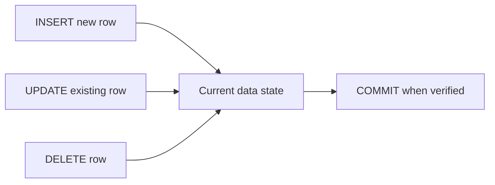

# Topic 03 — Data Manipulation Language (DML)
## Day 2 | Assmang Pty Ltd SQL100 Training

---

## 🎯 Learning Objectives

1. Insert single and multiple rows using INSERT INTO
2. Populate a table from a SELECT result (INSERT INTO ... SELECT)
3. Safely update rows with UPDATE ... WHERE
4. Delete specific rows with DELETE ... WHERE
5. Understand TRUNCATE vs DELETE
6. Use COMMIT and ROLLBACK for transaction safety

---

## Beginner Visual Map (Layman Version)

DML is everyday data work: add rows, change rows, remove rows, and do it safely.




## 1. Overview of DML

| Command | Action | Risk |
|---------|--------|------|
| `INSERT` | Add new rows | Low (adds only) |
| `UPDATE` | Change existing rows | **HIGH** — always use WHERE |
| `DELETE` | Remove rows permanently | **HIGH** — always use WHERE |
| `TRUNCATE` | Remove ALL rows fast | **VERY HIGH** — irreversible |

> **Golden Rule:** Before any UPDATE or DELETE, run the equivalent SELECT first to confirm you're targeting the right rows!

---

## 2. INSERT INTO — Adding Rows

### Single Row Insert
```sql
-- Insert a new employee
INSERT INTO employees
    (first_name, last_name, job_title, department_id, mine_id, salary_zar,
     hire_date, email, is_active, manager_id)
VALUES
    ('Themba', 'Nkosi', 'Safety Officer', 4, 2, 47000.00,
     '2024-03-01', 'th.nkosi@assmang.co.za', 1, 17);
```

### Multiple Row Insert (More Efficient)
```sql
-- Insert multiple employees at once
INSERT INTO employees
    (first_name, last_name, job_title, department_id, mine_id, salary_zar,
     hire_date, email, is_active, manager_id)
VALUES
    ('Ayanda',  'Mthethwa', 'Process Operator',   8, 5, 49000.00, '2024-01-15', 'a.mthethwa@assmang.co.za',  1, 29),
    ('Dieter',  'Kruger',   'Drill Rig Operator',  2, 5, 44000.00, '2024-02-01', 'd.kruger@assmang.co.za',    1, 10),
    ('Nonhlanhla','Mkhize', 'HR Officer',          1, NULL, 39000.00, '2024-04-01', 'n.mkhize@assmang.co.za', 1, 1);
```

### Insert INTO ... SELECT (Copy Data)
```sql
-- Create a summary/backup table (schema must exist)
-- First create the table:
CREATE TABLE employee_salary_snapshot (
    snapshot_date   DATE,
    employee_id     INT,
    full_name       VARCHAR(120),
    salary_zar      DECIMAL(12,2)
);

-- Populate from employees table
INSERT INTO employee_salary_snapshot (snapshot_date, employee_id, full_name, salary_zar)
SELECT
    CAST(GETDATE() AS date),
    employee_id,
    CONCAT(first_name, ' ', last_name),
    salary_zar
FROM employees
WHERE is_active = 1;
```

### Important Notes on INSERT
```sql
-- Columns can be omitted if they have DEFAULT or are IDENTITY
-- employee_id is an IDENTITY column — you don't specify it

-- ❌ WRONG — specifying an IDENTITY column value directly (usually causes error)
INSERT INTO employees (employee_id, first_name ...) VALUES (99, 'Test'...);

-- ✅ CORRECT — let the DB assign the ID
INSERT INTO employees (first_name, last_name ...) VALUES ('Test', 'User'...);
```

---

## 3. UPDATE — Modifying Existing Rows

```
UPDATE  table_name
SET     column1 = value1,
        column2 = value2
WHERE   condition;      ← ALWAYS include WHERE!
```

### Single Column Update
```sql
-- Give Thabo Mokoena (employee_id=2) a raise
-- Step 1: Verify first
SELECT employee_id, first_name, last_name, salary_zar
FROM employees
WHERE employee_id = 2;

-- Step 2: Update
UPDATE employees
SET salary_zar = 42000.00
WHERE employee_id = 2;

-- Step 3: Verify change
SELECT employee_id, first_name, last_name, salary_zar
FROM employees
WHERE employee_id = 2;
```

### Multiple Columns Update
```sql
-- Update Thabo's salary AND job title (promoted)
UPDATE employees
SET salary_zar  = 45000.00,
    job_title   = 'Senior HR Officer'
WHERE employee_id = 2;
```

### Update Multiple Rows
```sql
-- 5% salary increase for all employees earning below R45,000
-- Step 1: See who will be affected
SELECT employee_id, first_name, last_name, salary_zar
FROM employees
WHERE salary_zar < 45000;

-- Step 2: Apply the increase
UPDATE employees
SET salary_zar = ROUND(salary_zar * 1.05, 2)
WHERE salary_zar < 45000;
```

### Update Based on Condition
```sql
-- Mark Gloria Mine as non-operational
UPDATE mines
SET operational = 0
WHERE mine_name = 'Gloria Mine';

-- Update equipment status
UPDATE equipment
SET status = 'Active'
WHERE equipment_code = 'BEE-TR-002'
  AND status = 'Maintenance';
```

### ⚠️ Dangerous: UPDATE Without WHERE
```sql
-- ❌ NEVER DO THIS — updates ALL rows in the table!
UPDATE employees
SET salary_zar = 50000.00;   -- Every employee now earns R50,000!

-- ✅ Always include specific WHERE condition
UPDATE employees
SET salary_zar = 50000.00
WHERE employee_id = 25;
```

---

## 4. DELETE — Removing Rows

```
DELETE FROM table_name
WHERE condition;    ← ALWAYS include WHERE!
```

### Delete a Specific Row
```sql
-- Step 1: Verify which row you're about to delete
SELECT * FROM training_register WHERE register_id = 14;

-- Step 2: Delete it
DELETE FROM training_register
WHERE register_id = 14;

-- Step 3: Confirm it's gone
SELECT * FROM training_register WHERE register_id = 14;
-- Should return 0 rows
```

### Delete Multiple Rows by Condition
```sql
-- Remove all equipment that is 'Retired'
-- Step 1: Check
SELECT COUNT(*) FROM equipment WHERE status = 'Retired';  -- Expected: 1

-- Step 2: Delete
DELETE FROM equipment
WHERE status = 'Retired';
```

### Delete with Subquery
```sql
-- Delete training records for employees who are no longer active
DELETE FROM training_register
WHERE employee_id IN (
    SELECT employee_id FROM employees WHERE is_active = 0
);
```

### ⚠️ Dangerous: DELETE Without WHERE
```sql
-- ❌ NEVER DO THIS — deletes ALL rows from the table!
DELETE FROM employees;   -- Table is now empty!

-- ✅ Always filter with WHERE
DELETE FROM employees
WHERE employee_id = 99;
```

---

## 5. TRUNCATE vs DELETE

| Feature | DELETE (with no WHERE) | TRUNCATE |
|---------|----------------------|---------|
| Removes all rows | Yes | Yes |
| Can use WHERE | Yes | No |
| Can be rolled back | Yes (if in transaction) | No (mostly) |
| Resets IDENTITY seed | No | Yes |
| Speed | Slower (logs each row) | Faster |
| Fires triggers | Yes | No |

```sql
-- TRUNCATE — removes all rows (no ROLLBACK possible in most setups)
TRUNCATE TABLE employee_salary_snapshot;
-- employee_id auto-increment resets to 1

-- DELETE all rows (can be rolled back)
DELETE FROM employee_salary_snapshot;
-- Auto-increment does NOT reset
```

---

## 6. Transactions — COMMIT and ROLLBACK

A **transaction** groups SQL statements so they either all succeed or all fail together.

```
START TRANSACTION;
  -- your DML statements
COMMIT;     -- save permanently
-- OR
ROLLBACK;   -- undo everything since START TRANSACTION
```

### Example — Safe Update Flow
```sql
-- Safe salary update with transaction
START TRANSACTION;

-- Check current state
SELECT first_name, last_name, salary_zar FROM employees WHERE department_id = 2;

-- Apply update
UPDATE employees
SET salary_zar = ROUND(salary_zar * 1.08, 2)  -- 8% increase
WHERE department_id = 2;

-- Verify results
SELECT first_name, last_name, salary_zar FROM employees WHERE department_id = 2;

-- If you're happy with the result:
COMMIT;

-- If something went wrong:
-- ROLLBACK;
```

### Savepoints
```sql
START TRANSACTION;
  UPDATE employees SET salary_zar = 80000 WHERE employee_id = 1;
  SAVEPOINT after_emp1_update;

  UPDATE employees SET salary_zar = 45000 WHERE employee_id = 2;
  -- Oops, wrong salary for employee 2
  ROLLBACK TO after_emp1_update;  -- Undoes only employee 2 update

  UPDATE employees SET salary_zar = 42000 WHERE employee_id = 2;  -- corrected
COMMIT;
```

---

## 7. Referential Integrity and DML

When deleting or updating parent records, referential integrity may prevent the operation:

```sql
-- Trying to delete a department that has employees
DELETE FROM departments WHERE department_id = 2;
-- ERROR: Cannot delete or update a parent row: a foreign key constraint fails
-- employees.department_id references departments.department_id

-- Correct approach: delete/reassign employees first, then delete department
-- OR use CASCADE (advanced — not covered at beginner level)
```

---

## ⚠️ DML Safety Rules

```
BEFORE any UPDATE or DELETE:
1. Run SELECT with the same WHERE condition first
2. Verify the row count matches your expectation
3. Use START TRANSACTION before risky operations
4. Have ROLLBACK ready if unsure

THE GOLDEN RULE:
Never write UPDATE or DELETE without WHERE — unless you truly mean ALL rows.
```

---

## 📌 Quick Reference

```sql
-- Insert
INSERT INTO table (col1, col2) VALUES (v1, v2);
INSERT INTO table (col1, col2) VALUES (v1, v2), (v3, v4);
INSERT INTO table SELECT col1, col2 FROM other_table;

-- Update
UPDATE table SET col = value WHERE condition;
UPDATE table SET col1 = v1, col2 = v2 WHERE condition;

-- Delete
DELETE FROM table WHERE condition;

-- Truncate
TRUNCATE TABLE table_name;

-- Transactions
START TRANSACTION;
  -- DML statements
COMMIT;   -- or ROLLBACK;
```

