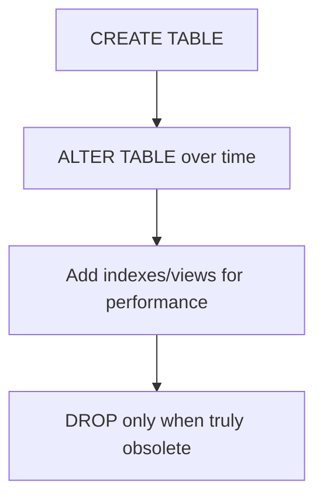
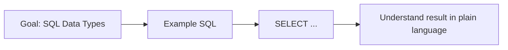
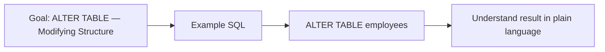
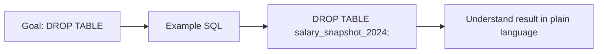
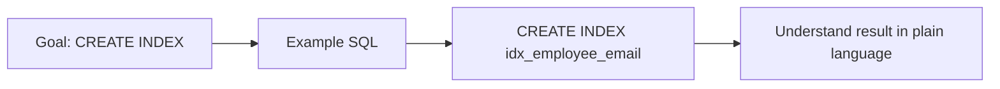
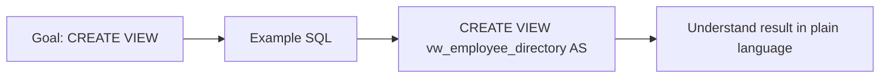
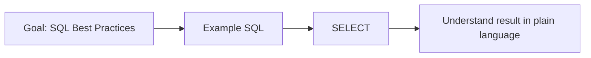
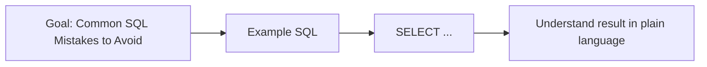

# Topic 04 — DDL: CREATE, ALTER, DROP & SQL Best Practices
## Day 2 | Assmang Pty Ltd SQL100 Training

---

## 🎯 Learning Objectives

1. Create tables with appropriate data types and constraints
2. Modify existing tables using ALTER TABLE
3. Drop tables and databases
4. Create and use views
5. Understand indexing basics
6. Apply SQL best practices and know common pitfalls

---

## Beginner Visual Map (Layman Version)

DDL is like building design work: create a new room, modify it, or remove it entirely.




## 1. Overview of DDL

### Concept Diagram


DDL commands change the **structure** of the database — not the data.

| Command | Purpose |
|---------|---------|
| `CREATE TABLE` | Define a new table |
| `ALTER TABLE` | Modify an existing table |
| `DROP TABLE` | Permanently delete a table (structure + data) |
| `CREATE INDEX` | Improve query performance |
| `CREATE VIEW` | Save a query as a reusable virtual table |
| `TRUNCATE TABLE` | Remove all rows (also DDL-level in most engines) |

> ⚠️ DDL commands are generally auto-committed in SQL Server — do not assume they can be rolled back after execution.

---

## 2. SQL Data Types

### Concept Diagram



Choosing the right data type matters for storage efficiency and data integrity.

### Numeric Types

| Type | Range/Size | Use For |
|------|-----------|---------|
| `TINYINT` | 0–255 or -128–127 | Boolean flags (0/1), small codes |
| `SMALLINT` | 0–65535 | Small counts |
| `INT` / `INTEGER` | 0–4 billion | IDs, general integers |
| `BIGINT` | Very large numbers | Large IDs, counts |
| `DECIMAL(p,s)` | Exact precision | Salaries, prices, grades |
| `FLOAT` / `DOUBLE` | Approximate | Scientific, GPS values |

### String Types

| Type | Description | Use For |
|------|-------------|---------|
| `CHAR(n)` | Fixed length, always n chars | Status codes ('M', 'F') |
| `VARCHAR(n)` | Variable length, up to n | Names, emails, descriptions |
| `TEXT` | Up to 65,535 chars | Long descriptions |
| `LONGTEXT` | Up to 4GB | Documents, logs |

### Date/Time Types

| Type | Format | Use For |
|------|--------|---------|
| `DATE` | YYYY-MM-DD | Hire dates, birth dates |
| `TIME` | HH:MM:SS | Shift start/end times |
| `DATETIME` | YYYY-MM-DD HH:MM:SS | Timestamps, log entries |
| `TIMESTAMP` | Auto-updates on insert/update | Audit trail |

### Other

| Type | Use For |
|------|---------|
| `BIT` | True/False flags |
| `CHECK (...)` | Restricted list of values |

---

## 3. CREATE TABLE

### Concept Diagram

```mermaid
flowchart LR
    A[Goal: CREATE TABLE] --> B[Example SQL]
    B --> C[CREATE TABLE table_name (]
    C --> D[Understand result in plain language]
```

```sql
CREATE TABLE table_name (
    column_name  data_type  [constraints],
    ...
    [table_constraints]
);
```

### Basic Example
```sql
CREATE TABLE contractors (
    contractor_id       INT             IDENTITY(1,1) NOT NULL,
    company_name        VARCHAR(150)    NOT NULL,
    contact_person      VARCHAR(100)    NOT NULL,
    contact_email       VARCHAR(150)    NOT NULL UNIQUE,
    mine_id             INT,
    contract_start      DATE            NOT NULL,
    contract_end        DATE,
    daily_rate_zar      DECIMAL(10,2)   NOT NULL DEFAULT 0.00,
    is_active           BIT             NOT NULL DEFAULT 1,
    PRIMARY KEY (contractor_id),
    FOREIGN KEY (mine_id) REFERENCES mines(mine_id)
);
```

### Column Constraints

| Constraint | Meaning | Example |
|-----------|---------|---------|
| `NOT NULL` | Value must be provided | `first_name VARCHAR(60) NOT NULL` |
| `UNIQUE` | No duplicate values | `email VARCHAR(120) UNIQUE` |
| `DEFAULT value` | Auto-fills if no value given | `is_active BIT DEFAULT 1` |
| `IDENTITY(1,1)` | Automatically assigns next number | `id INT IDENTITY(1,1)` |
| `PRIMARY KEY` | Unique + NOT NULL + index | `PRIMARY KEY (id)` |
| `FOREIGN KEY` | References another table's PK | `FOREIGN KEY (dept_id) REFERENCES departments(department_id)` |
| `CHECK` | Custom validation rule | `CHECK (salary > 0)` |

### Guarding Re-runs (avoid errors on re-run)
```sql
IF OBJECT_ID('dbo.contractors', 'U') IS NULL
BEGIN
    CREATE TABLE contractors (
        contractor_id INT IDENTITY(1,1) PRIMARY KEY
        -- ...
    );
END;
```

---

## 4. ALTER TABLE — Modifying Structure

### Concept Diagram



### Add a Column
```sql
-- Add phone number to employees
ALTER TABLE employees
ADD COLUMN phone_number VARCHAR(20);

-- Add with constraints
ALTER TABLE employees
ADD employee_code VARCHAR(10) UNIQUE;
```

### Modify a Column (Change Type/Size)
```sql
-- Increase email column size
ALTER TABLE employees
MODIFY COLUMN email VARCHAR(200) NOT NULL;

-- Change job_title to allow longer values
ALTER TABLE employees
MODIFY COLUMN job_title VARCHAR(150);
```

### Rename a Column
```sql
ALTER TABLE employees
EXEC sp_rename 'dbo.contractors.phone_number', 'mobile_number', 'COLUMN';
```

### Drop a Column
```sql
ALTER TABLE employees
DROP COLUMN mobile_number;
```

### Add a Constraint
```sql
-- Add CHECK constraint
ALTER TABLE employees
ADD CONSTRAINT chk_salary CHECK (salary_zar > 0);
```

### Rename a Table
```sql
ALTER TABLE salary_snapshot_2024
RENAME TO salary_snapshots;
```

---

## 5. DROP TABLE

### Concept Diagram



```sql
-- Permanently deletes table structure AND all data — CANNOT be undone!
DROP TABLE salary_snapshot_2024;

-- Safer version — no error if table doesn't exist
DROP TABLE IF EXISTS salary_snapshot_2024;

-- Drop multiple tables
DROP TABLE IF EXISTS table1, table2;
```

> ⚠️ If other tables reference this table via Foreign Keys, DROP will fail. Remove FKs first.

---

## 6. CREATE INDEX

### Concept Diagram



An index improves SELECT query performance on large tables:

```sql
-- Index on frequently searched column (employee email lookups)
CREATE INDEX idx_employee_email
ON employees (email);

-- Composite index (department + salary filtering)
CREATE INDEX idx_dept_salary
ON employees (department_id, salary_zar);

-- Unique index (same as UNIQUE constraint)
CREATE UNIQUE INDEX idx_equip_code
ON equipment (equipment_code);

-- View existing indexes
EXEC sp_helpindex 'dbo.employees';

-- Drop an index
DROP INDEX idx_employee_email ON employees;
```

### When to Index
- Columns used frequently in WHERE clauses
- Columns used in JOINs (FK columns)
- Columns used in ORDER BY for large tables
- **Don't** index every column — indexes slow down INSERT/UPDATE/DELETE

---

## 7. CREATE VIEW

### Concept Diagram



A **view** is a saved SELECT query that behaves like a virtual table:

```sql
-- Create a view for the employee directory (no salary visible)
CREATE VIEW vw_employee_directory AS
SELECT
    e.employee_id,
    CONCAT(e.first_name, ' ', e.last_name)  AS full_name,
    e.job_title,
    d.department_name,
    COALESCE(m.mine_name, 'Head Office')    AS site,
    e.email
FROM employees e
INNER JOIN departments d ON e.department_id = d.department_id
LEFT  JOIN mines m       ON e.mine_id       = m.mine_id
WHERE e.is_active = 1;

-- Use the view like a table
SELECT * FROM vw_employee_directory WHERE site = 'Head Office';
SELECT * FROM vw_employee_directory ORDER BY department_name, full_name;

-- Change data without view knowledge
SELECT department_name, COUNT(*) AS total
FROM vw_employee_directory
GROUP BY department_name;
```

```sql
-- Create payroll summary view
CREATE VIEW vw_payroll_summary AS
SELECT
    d.department_name,
    COUNT(e.employee_id)        AS headcount,
    SUM(e.salary_zar)           AS monthly_payroll,
    ROUND(AVG(e.salary_zar),2)  AS avg_salary
FROM employees e
INNER JOIN departments d ON e.department_id = d.department_id
WHERE e.is_active = 1
GROUP BY d.department_id, d.department_name;

-- Use it
SELECT * FROM vw_payroll_summary ORDER BY monthly_payroll DESC;
```

```sql
-- Update a view
CREATE OR ALTER VIEW vw_employee_directory AS
SELECT employee_id, CONCAT(first_name, ' ', last_name) AS full_name, job_title
FROM employees WHERE is_active = 1;

-- Drop a view
DROP VIEW IF EXISTS vw_employee_directory;

-- List views
SELECT name FROM sys.views ORDER BY name;
```

---

## 8. SQL Best Practices

### Concept Diagram



### Formatting & Readability
```sql
-- ✅ Good: Uppercase keywords, aligned columns, lowercase identifiers
SELECT
    e.employee_id,
    CONCAT(e.first_name, ' ', e.last_name)  AS full_name,
    d.department_name
FROM employees    e
INNER JOIN departments d ON e.department_id = d.department_id
WHERE e.is_active = 1
ORDER BY d.department_name;

-- ❌ Bad: Random case, no spacing, hard to read
select e.employee_id,concat(e.first_name,' ',e.last_name) as full_name,d.department_name from employees e inner join departments d on e.department_id=d.department_id where e.is_active=1
```

### Naming Conventions
```sql
-- ✅ snake_case, descriptive names
employee_id, first_name, hire_date, is_active

-- ❌ Vague or ambiguous
empID, fn, dt, flag
```

### Avoid SELECT * in Production
```sql
-- ❌ Avoid in production code (fetches unnecessary data, breaks on schema change)
SELECT * FROM employees;

-- ✅ Name your columns
SELECT employee_id, first_name, last_name, job_title FROM employees;
```

---

## 9. Common SQL Mistakes to Avoid

### Concept Diagram



| # | Mistake | Impact | Prevention |
|---|---------|--------|------------|
| 1 | UPDATE/DELETE without WHERE | Data loss — all rows affected | Always check with SELECT first |
| 2 | `WHERE col = NULL` instead of `IS NULL` | Returns 0 rows | Always use `IS NULL` / `IS NOT NULL` |
| 3 | Off-by-one in BETWEEN | Wrong range | Remember BETWEEN is inclusive |
| 4 | Forgetting NOT IN behaviour with NULLs | Returns no rows | Remove NULLs from IN list |
| 5 | Using alias in WHERE clause | Error | Repeat the expression in WHERE |
| 6 | SELECT * in production | Performance, security | Always list required columns |
| 7 | Missing parentheses in OR/AND | Wrong logic | Always parenthesise OR conditions |
| 8 | Cartesian product from missing JOIN | Millions of rows | Always specify ON clause |
| 9 | DDL without IF EXISTS/IF NOT EXISTS | Script fails on rerun | Always use IF EXISTS guards |
| 10 | No transaction on bulk DML | Can't undo mistakes | Use START TRANSACTION + COMMIT |

---

## 10. Next Steps — What to Learn After SQL100

### Concept Diagram

```mermaid
flowchart LR
    A[Goal: Next Steps — What to Learn After SQL100] --> B[Example SQL]
    B --> C[CREATE TABLE (IF NOT EXISTS) t (col type (constraints), PRIMARY KEY(co]
    C --> D[Understand result in plain language]
```

| Path | Topics |
|------|--------|
| **SQL200** | Window functions, CTEs (WITH clause), advanced subqueries, PIVOT |
| **Database Design** | Normalisation (1NF–3NF), ER modelling, schema design |
| **Stored Procedures** | CREATE PROCEDURE, IF/LOOP/CURSOR in SQL |
| **Performance Tuning** | EXPLAIN, query optimisation, index strategy |
| **ETL/BI** | SQL in Power BI, Tableau, Python Pandas |
| **Cloud Databases** | Azure SQL, AWS RDS, Google BigQuery |

---

## 📌 DDL Quick Reference

```sql
-- Create table
CREATE TABLE [IF NOT EXISTS] t (col type [constraints], PRIMARY KEY(col));

-- Add column
ALTER TABLE t ADD COLUMN col type;

-- Modify column
ALTER TABLE t MODIFY COLUMN col new_type;

-- Drop column
ALTER TABLE t DROP COLUMN col;

-- Drop table
DROP TABLE [IF EXISTS] t;

-- Create index
CREATE INDEX idx_name ON table(column);

-- Create view
CREATE [OR REPLACE] VIEW vw_name AS SELECT ...;

-- Drop view
DROP VIEW [IF EXISTS] vw_name;
```

